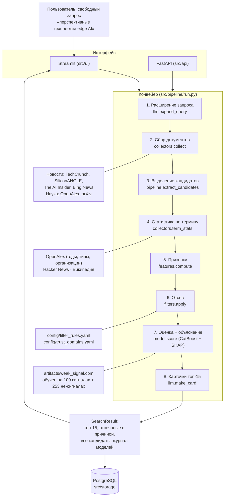

# Архитектура: как устроен сервис

> Документ для сдачи. Схема, шаги конвейера, что происходит при отказах и сколько всё занимает
> по измерениям на реальном прогоне 20.09.2026.

## 1. Общая схема



Языковая модель (Qwen через Ollama) участвует только в шагах 1, 3 и 8 — формулирует поисковые фразы,
вытаскивает названия технологий из найденных документов и пишет тексты карточек по этим же документам.
**Решение «сигнал или нет» принимает CatBoost по измеримым признакам**, а не языковая модель: этого
требует ТЗ (объяснимость и запрет на выдачу «из знаний модели»).

## 2. Что делает каждый шаг

| Шаг | Вход → выход | Владелец | Бюджет времени |
| --- | --- | --- | --- |
| 1. Расширение запроса | запрос → 10–20 фраз (RU + EN) | Интеграция | 120 с |
| 2. Сбор документов | фразы → до 500 документов | Данные | 60 с |
| 3. Выделение кандидатов | документы → 40–60 технологий | Интеграция | 40 с |
| 4. Статистика по термину | термин → публикации, медиа, Википедия | Данные | 60 с |
| 5. Признаки | документы + статистика → 10 чисел | ML | — |
| 6. Отсев | признаки → «исключить и почему» | Продукт | — |
| 7. Оценка | признаки → уверенность + 3 причины | ML | — |
| 8. Карточки | топ-15 → тексты по источникам | Интеграция | 60 с |

Каждый шаг ограничен по времени и имеет запасной вариант: если шаг не успел, конвейер идёт дальше
с тем, что есть, и пишет об этом в лог. Прогон не падает целиком из-за одного медленного источника.

## 3. Признаки и решение

Десять признаков (`src/features/compute.py`): всего публикаций, публикации за последний год, рост за 3 года,
доля работ за последние 3 года, возраст темы, упоминания в техмедиа всего и за 3 года, медиа на одну научную
работу, статья в Википедии, доля препринтов. Подробно — в [методологии](methodology.md).

Порядок решения: **сначала правила, потом модель.** Правила отсекают только очевидное (зрелое, медийное,
шум) и всегда объясняют причину по-русски с цифрами. Всё неочевидное решает CatBoost, и его ответ
раскладывается на вклады признаков через SHAP — это и есть объяснение в карточке.

## 4. Что происходит при отказах

Проверено на живых прогонах, а не задумано «на бумаге»:

| Что отказало | Что делает сервис |
| --- | --- |
| Одна лента новостей отвечает 429 | Выключает её до конца прогона, собирает остальные |
| Источник не ответил или превысил таймаут | Пишет его имя в `errors`, признак остаётся пустым |
| Статистика не успела по части кандидатов | Считает их признаки только по найденным документам |
| Нет PostgreSQL | Работает без сохранения: после первой неудачи к базе не обращается |
| Языковая модель недоступна | Шаг возвращает пустой результат, конвейер продолжается |
| Пустая доля препринтов | Заполняется медианой обучающей выборки, а не нулём |

Пустой признак никогда не означает «плохо»: правила отсева не срабатывают на отсутствии данных.

## 5. Сколько занимает прогон

Измерено 20.09.2026 на ПК с RTX 3060 12 ГБ (Qwen3 14B целиком на видеокарте, `ollama ps` показывает
`100% GPU`, 32.3 токена в секунду). Запрос по области Edge, кэш ответов модели отключён — то есть
это холодный прогон, какой получит жюри на новом запросе:

| Шаг | Время | Бюджет |
| --- | --- | --- |
| Расширение запроса (18 фраз, 7 добраны отдельным вызовом) | 11.8 с | 120 с |
| Сбор документов (102 шт.) | 51.7 с | 60 с — упёрся |
| Выделение кандидатов (60 из 102 документов) | 133.6 с | 180 с |
| Статистика по 60 кандидатам | 60.1 с | 60 с — упёрся, успела по 40 |
| Отсев и оценка моделью (CatBoost + SHAP) | < 1 с | — |
| Карточки (15 вызовов модели) | 182.2 с | 300 с |
| **Весь прогон** | **444.0 с** | |

Результат: 102 документа, 60 кандидатов, 53 после отсева, 15 карточек.

**Узкое место сместилось.** На ноутбуке всё упиралось в языковую модель на процессоре: Qwen3 4B
давала 8.7 токена в секунду, 8B — 2.2, и прогон по той же области занимал 1400.9 с (сохранён
в `data/search_runs/`). На видеокарте модель перестала быть ограничителем, и теперь в потолок
бюджета упираются два шага: **сбор документов** и **статистика по терминам**.

Сбор документов — самый важный из них. Ограничение не в скорости сети, а в лимитах источников:
arXiv просит паузу 3 секунды между запросами, техмедиа отвечают 429 на параллельный залп. За 60
секунд на 18 фразах успевает прийти около 100 документов. Если те же фразы уже спрашивали и ответы
лежат в кэше, собирается до 500. По `docs/HANDOFF.md` охват документов — потолок для всей выдачи,
поэтому увеличение этого бюджета даёт больше, чем любые улучшения модели.

Статистика по терминам не успевает по трети кандидатов: их признаки считаются только по найденным
документам, без данных о публикациях. Прогон при этом не падает — пустой признак не означает «плохо»,
см. раздел 4.

## 6. Стек

Python 3.11, pydantic v2 (контракты в `src/common/schemas.py`), httpx (все источники асинхронно),
CatBoost + SHAP, PostgreSQL 16 через SQLAlchemy 2, Ollama (Qwen3), Streamlit, FastAPI, pytest, ruff.

## 7. Где чей код

| Папка | Владелец |
| --- | --- |
| `src/common`, `src/features`, `src/model`, `notebooks`, `reports` | ML и ядро |
| `src/collectors`, `src/storage` | Данные |
| `src/llm`, `src/pipeline`, `src/api` | Интеграция |
| `src/ui`, `src/filters`, `src/trust`, `config`, `docs` | Продукт |

## 8. Как воспроизвести

```bash
ollama pull qwen3:14b                # локальная модель (на процессоре — qwen3:8b или 4b)
pip install -r requirements.txt
python -m src.pipeline.cli "перспективные технологии edge AI и граничных вычислений"
streamlit run src/ui/app.py          # интерфейс
pytest -m "not network"              # тесты без сети
```
