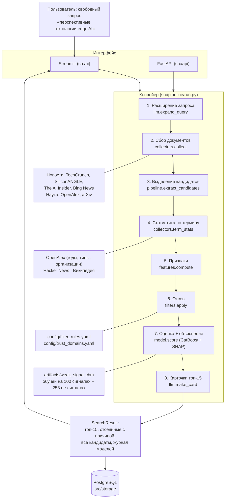

# Архитектура: как устроен сервис

> Документ для сдачи. Схема, шаги конвейера, что происходит при отказах и сколько всё занимает
> по измерениям на реальном прогоне 20.09.2026.

## 1. Общая схема



Языковая модель (Qwen через Ollama) участвует только в шагах 1, 3 и 8 — формулирует поисковые фразы,
вытаскивает названия технологий из найденных документов и пишет тексты карточек по этим же документам.
**Решение «сигнал или нет» принимает CatBoost по измеримым признакам**, а не языковая модель: этого
требует ТЗ (объяснимость и запрет на выдачу «из знаний модели»).

## 2. Что делает каждый шаг

| Шаг | Вход → выход | Владелец | Бюджет времени |
| --- | --- | --- | --- |
| 1. Расширение запроса | запрос → 16–22 фразы (в основном EN) | Интеграция | 120 с |
| 2. Сбор документов | фразы → до 2000 документов | Данные | 60 с + 30 с запаса |
| 3. Выделение кандидатов | документы → 40–150 технологий | Интеграция | 150 с (внешний 250 с) |
| 4. Статистика по термину | термин → публикации, медиа, Википедия | Данные | 240 с |
| 5. Признаки | документы + статистика → 10 чисел | ML | — |
| 6. Отсев | признаки → «исключить и почему» | Продукт | — |
| 7. Оценка | признаки → уверенность + 3 причины | ML | — |
| 8. Карточки | топ-15 → тексты по источникам | Интеграция | 300 с |

Каждый шаг ограничен по времени и имеет запасной вариант: если шаг не успел, конвейер идёт дальше
с тем, что есть, и пишет об этом в лог. Прогон не падает целиком из-за одного медленного источника.

## 3. Признаки и решение

Десять признаков (`src/features/compute.py`): всего публикаций, публикации за последний год, рост за 3 года,
доля работ за последние 3 года, возраст темы, упоминания в техмедиа всего и за 3 года, медиа на одну научную
работу, статья в Википедии, доля препринтов. Подробно — в [методологии](methodology.md).

Порядок решения: **сначала правила, потом модель.** Правила отсекают только очевидное (зрелое, медийное,
шум) и всегда объясняют причину по-русски с цифрами. Всё неочевидное решает CatBoost, и его ответ
раскладывается на вклады признаков через SHAP — это и есть объяснение в карточке.

## 4. Что происходит при отказах

Проверено на живых прогонах, а не задумано «на бумаге»:

| Что отказало | Что делает сервис |
| --- | --- |
| Одна лента новостей отвечает 429 | Выключает её до конца прогона, собирает остальные |
| Источник не ответил или превысил таймаут | Пишет его имя в `errors`, признак остаётся пустым |
| Статистика не успела по части кандидатов | Считает их признаки только по найденным документам |
| Нет PostgreSQL | Работает без сохранения: после первой неудачи к базе не обращается |
| Языковая модель недоступна | Шаг возвращает пустой результат, конвейер продолжается |
| Пустая доля препринтов | Заполняется медианой обучающей выборки, а не нулём |

Пустой признак никогда не означает «плохо»: правила отсева не срабатывают на отсутствии данных.

**Отказ источника не виден по результату прогона, и это опасно.** Сервис продолжает работу —
так и задумано, — но выдаёт столько же карточек и даже быстрее обычного: отказ приходит
мгновенно, а не по таймауту. 21.09 исчерпанный дневной лимит OpenAlex дважды незаметно испортил
замеры: один раз мы приняли ускорение шага за успех правки, другой раз списали падение качества
на неудачный промпт. Поэтому прогон теперь перечисляет не ответившие источники рядом с выдачей
(`SearchResult.source_failures`), а не только в журнале.

## 5. Сколько занимает прогон

Измерено 20.09.2026 на ПК с RTX 3060 12 ГБ (Qwen3 14B целиком на видеокарте, `ollama ps` показывает
`100% GPU`, 32.3 токена в секунду). Запрос по области Edge, кэш ответов модели отключён — то есть
это холодный прогон, какой получит жюри на новом запросе:

| Шаг | Время | Бюджет |
| --- | --- | --- |
| Расширение запроса (18 фраз, 7 добраны отдельным вызовом) | 11.8 с | 120 с |
| Сбор документов (102 шт.) | 51.7 с | 60 с — упёрся |
| Выделение кандидатов (60 из 102 документов) | 133.6 с | 180 с |
| Статистика по 60 кандидатам | 60.1 с | 60 с — упёрся, успела по 40 |
| Отсев и оценка моделью (CatBoost + SHAP) | < 1 с | — |
| Карточки (15 вызовов модели) | 182.2 с | 300 с |
| **Весь прогон** | **444.0 с** | |

Результат: 102 документа, 60 кандидатов, 53 после отсева, 15 карточек.

**Узкое место сместилось дважды.** На ноутбуке всё упиралось в языковую модель на процессоре:
Qwen3 4B давала 8.7 токена в секунду, 8B — 2.2, и прогон по той же области занимал 1400.9 с
(сохранён в `data/search_runs/`). На видеокарте модель перестала быть ограничителем по скорости,
и какое-то время мы считали узким местом **сбор документов**.

Замер 21.09 это опроверг. Сбор перестал быть ограничителем сам: после того как поисковые фразы
стали называть технологии, а не описывать их, за прогон приходит 400–2000 документов вместо сотни.
Ограничитель теперь — **сколько из собранного успевает прочитать модель**.

### Сколько документов модель успевает прочитать

Шаг выделения кандидатов читает документы пачками по 8 и на каждую пачку тратит около 10 секунд.
При бюджете 150 с это 13–15 пачек, то есть **104–120 документов** (посчитано по журналу вызовов
модели в шести ночных прогонах 21.09). Собрано при этом было от 418 до 2000 документов.

| Область | Собрано | Пачек | Прочитано | Доля |
| --- | --- | --- | --- | --- |
| Инфраструктура ИИ | 418 | 13 | 104 | 25% |
| Финтех | 668 | 14 | 112 | 17% |
| Edge | 1159 | 15 | 120 | 10% |
| Индустриальный ИИ | 1159 | 13 | 104 | 9% |
| Роботы | 1832 | 14 | 112 | 6% |
| Защита ИИ | 2000 | 14 | 112 | 6% |

Предел `MAX_DOCS_FOR_LLM = 500` при этом ни разу не срабатывает: шаг останавливается по бюджету
задолго до него.

**Быстрее читать не получается.** Замерили шесть конфигураций на RTX 3060 с Qwen3 14B: пачки по 8,
16 и 32 документа, по одному, два и три одновременных запроса. Скорость во всех случаях одна —
**около 33 технологий в минуту**. Причина видна в таймингах самой Ollama: на чтение документов
уходит 2.5–7.6 с, на генерацию ответа — 32–37 с, то есть 85–90% времени. Одновременные запросы
не помогают: Ollama выполняет их по очереди. Пачка из 32 документов вдобавок даёт **хуже**
результат — 13 технологий против 19–20 у пачек по 8 и 16: модель на таком объёме начинает
скользить по верхам.

Практический вывод: **собирать больше документов бесполезно, пока мы читаем 6% собранного.**
Значение имеет не объём сбора, а порядок, в котором документы попадают в очередь к модели
(см. `_order_for_llm` в `src/pipeline/candidates.py`).

Статистика по терминам не успевает по трети кандидатов: их признаки считаются только по найденным
документам, без данных о публикациях. Прогон при этом не падает — пустой признак не означает «плохо»,
см. раздел 4.

## 5а. Сколько технологий доходит до выдачи

Главное число проекта: сколько технологий из датасета организаторов вообще попадает
в собранные документы. Чего нет там — не будет ни в кандидатах, ни в топ-15.

Измерено 21.09 на шести областях, поисковые фразы зафиксированы для сравнимости замеров
(`python -m src.model.eval_search --ceiling`):

| Шаг | Технологий датасета из 100 |
| --- | --- |
| Упомянуты в собранных документах — названием или компанией | 38 |
| …из них **названы** так, как их называет датасет | 12 |
| Модель успела прочитать документ с этой технологией | 4 |
| Выписана в кандидаты | 3 |
| Попало в топ-15 | 2 |

Первые две строки считаются по-разному, и разницу важно понимать. Официальный замер
(`--ceiling`) засчитывает технологию, если в документах упомянут её термин **или** название
одной из компаний. Это оптимистичный счёт: документ про компанию может не содержать самого
названия технологии, и тогда назвать её так же, как датасет, нам будет не из чего. Строгий
счёт — по названию — даёт 12 из 100 на корпусе из 7031 документа (замер 21.09).

**Главная потеря — между второй и третьей строкой.** Из 12 технологий, названных в собранных
документах, модель видит документ только про 4: она читает 6–25% собранного (см. раздел 5).
Дальше потери небольшие: из 4 прочитанных выписаны 3, из 3 выписанных в топ-15 попали 2 —
третья получила оценку 0.05 и осталась на 24-м месте.

Проверка «как у жюри» (`--run-all`) показывает в топ-15 не 2, а 3 технологии. Разница —
в правиле сверки: оно отбрасывает общие слова вроде «platform», и тогда наше широкое название
засчитывается против более узкого датасетного. Такое совпадение эксперт, скорее всего,
не зачтёт, поэтому в этой таблице стоит 2. Разрыв между двумя счётами стоит держать в голове
при чтении любых наших отчётов по метрике.

Для сравнения: если спросить те же наши источники **точным названием** технологии,
находятся 88 из 100 (arXiv 69, новостные ленты 63). То есть потолок держат не источники,
а формулировки поисковых фраз — и это то, над чем идёт работа.

Счёт строгий: совпадение засчитывается, только когда наше название не шире датасетного.
Организаторы уточнили, что эксперт сверяет по смыслу и по названию, а название слабого
сигнала узкое, поэтому широкая формулировка не засчитывается.

## 5б. Как считается главное число

Проверка «как у жюри» (`python -m src.model.eval_search --run-all`) вводит запрос по каждой
из шести областей и сверяет топ-15 со списком технологий этой области.

**Засчитывается только то, что написали мы сами**: название карточки, русское название
и описание. Заголовки статей из списка источников не в счёт. Так пришлось сделать после
разбора 21.09: оказалось, что все до единого совпадения приходили именно оттуда — термин
датасета встречался в заголовке статьи, на которую мы сослались, а в нашем названии его
не было. Организаторы уточнили (19.09), что эксперт смотрит на суть и название сигнала,
а не на то, на что мы сослались.

Названия сверяются по словам с приведением к основе, чтобы единственное число не расходилось
с множественным. Требуется, чтобы **все** значащие слова термина датасета были в нашем
названии: наше может быть уже датасетного, но не шире — широкую формулировку эксперт
не засчитает. Служебными считаются только предлоги и связки; слова вроде «platform»
или «system» часть названия и выбрасывать их нельзя.

Счёт заведомо строгий. Настоящая оценка жюри может оказаться выше, но занижать себе
измерение безопаснее, чем завышать.

## 5в. Источники карточки

Второй круг (шаг между скорингом и карточками) ищет имя кандидата точной фразой, чтобы
карточка опиралась на документы **про** технологию, а не упоминающие её вскользь. Замер
на двух прогонах по шести областям:

| | Без второго круга | Со вторым кругом |
| --- | --- | --- |
| Источников в карточках | 128 | 265 |
| Карточек, где ни один источник не про эту технологию | 20 | 7 |

## 6. Стек

Python 3.11, pydantic v2 (контракты в `src/common/schemas.py`), httpx (все источники асинхронно),
CatBoost + SHAP, PostgreSQL 16 через SQLAlchemy 2, Ollama (Qwen3), Streamlit, FastAPI, pytest, ruff.

## 7. Где чей код

| Папка | Владелец |
| --- | --- |
| `src/common`, `src/features`, `src/model`, `notebooks`, `reports` | ML и ядро |
| `src/collectors`, `src/storage` | Данные |
| `src/llm`, `src/pipeline`, `src/api` | Интеграция |
| `src/ui`, `src/filters`, `src/trust`, `config`, `docs` | Продукт |

## 8. Как воспроизвести

```bash
ollama pull qwen3:14b                # локальная модель (на процессоре — qwen3:8b или 4b)
pip install -r requirements.txt
python -m src.pipeline.cli "перспективные технологии edge AI и граничных вычислений"
streamlit run src/ui/app.py          # интерфейс
pytest -m "not network"              # тесты без сети
```
