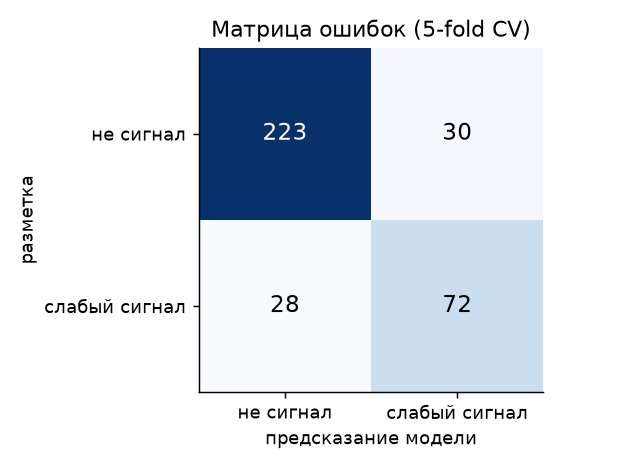
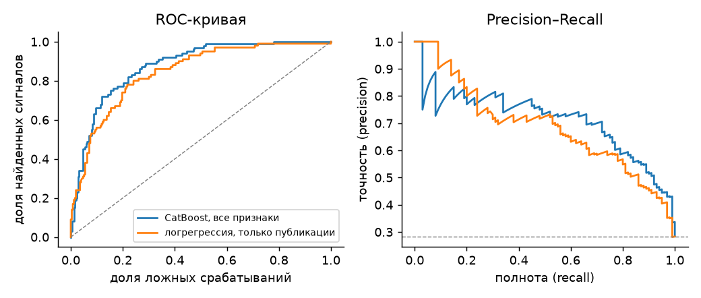
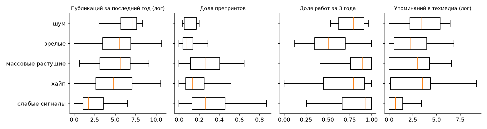
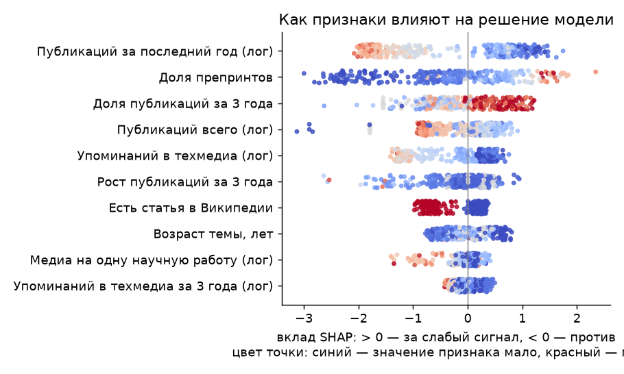

# Отчёт об оценке модели «слабый сигнал / нет»

Выборка: 353 технологий — 100 слабых сигналов из датасета организаторов и 253 отрицательных примеров команды (`src/model/training/negatives.csv`).
Оценка — 5-fold stratified кросс-валидация: каждый пример проверяется моделью, которая его не видела.
Главная метрика по ответу организаторов — accuracy. Методология — `docs/methodology.md`.

## Метрики

| Метрика | CatBoost (итоговая модель) | Базовая линия: логрегрессия на публикациях |
| --- | --- | --- |
| accuracy | 0.836 | 0.765 |
| precision | 0.706 | 0.561 |
| recall | 0.720 | 0.780 |
| f1 | 0.713 | 0.653 |
| roc_auc | 0.878 | 0.843 |
| pr_auc | 0.714 | 0.688 |

## Точность по типам примеров

| Тип | Примеров | Верных ответов |
| --- | --- | --- |
| хайп | 42 | 86% |
| массовые растущие | 28 | 75% |
| зрелые | 172 | 91% |
| шум | 11 | 91% |
| слабые сигналы | 100 | 72% |

## Чем слабые сигналы отличаются от остального

## Объяснимость: вклад признаков (SHAP)

Каждая точка — одна технология. Справа от нуля — признак толкает к «слабому сигналу», слева — против.

